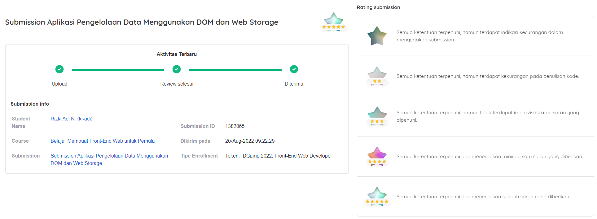

# Bookshelf

## Overview
This web application was created as a requirement for completing the ["Belajar Membuat Front-End Web untuk Pemula"](https://www.dicoding.com/academies/315) class at Dicoding with program [IDCamp 2022](https://idcamp.ioh.co.id/) from Indosat Ooredoo Hutchison. It is built natively using HTML, SCSS, and Javascript.

This application is capable of storing data in Web Storage, manipulating the DOM, having a responsive design on any device, and providing good functionality as well as a highly interactive display.

## How to use
1. Clone the project repository to your local machine using a Git client (e.g. git clone https://github.com/k1adi/bookshelf.git) or by downloading the project as a zip file.
2. Open index.html with your browser (If you are using Visual Studio Code, you can use [Live Server](https://marketplace.visualstudio.com/items?itemName=ritwickdey.LiveServer) extension to run this web application.)

Since this web application is built natively, you can run it directly without any installation process.

Alternatively, you can directly access the deployed web application at https://bookshelf-k1adi.netlify.app/

## Features
- Switch theme (light/dark).
- Add new book category data.
- Change book category name.
- Delete book category data.
- Has two statuses for book data.
- Add new book data.
- Change book status.
- Delete book data.
- Search for book data by name and category according by statuses.
- Utilizes browser localStorage to store data.
- Records user activity in trying out all the functions of the web application.

## Submission info

## Author
- GitHub - [k1adi](https://github.com/k1adi)
- CodePen - [@k1adi](https://codepen.io/k1adi)
- Dicoding - [ki-adi](https://www.dicoding.com/users/ki-adi)

## License
Copyright [2022] [k1adi]

Permission is hereby granted, free of charge, to any person obtaining a copy of this software and associated documentation files (the “Software”), to deal in the Software without restriction, including without limitation the rights to use, copy, modify, merge, publish, distribute, sublicense, and/or sell copies of the Software, and to permit persons to whom the Software is furnished to do so, subject to the following conditions:

The above copyright notice and this permission notice shall be included in all copies or substantial portions of the Software.

THE SOFTWARE IS PROVIDED “AS IS”, WITHOUT WARRANTY OF ANY KIND, EXPRESS OR IMPLIED, INCLUDING BUT NOT LIMITED TO THE WARRANTIES OF MERCHANTABILITY, FITNESS FOR A PARTICULAR PURPOSE AND NONINFRINGEMENT. IN NO EVENT SHALL THE AUTHORS OR COPYRIGHT HOLDERS BE LIABLE FOR ANY CLAIM, DAMAGES OR OTHER LIABILITY, WHETHER IN AN ACTION OF CONTRACT, TORT OR OTHERWISE, ARISING FROM, OUT OF OR IN CONNECTION WITH THE SOFTWARE OR THE USE OR OTHER DEALINGS IN THE SOFTWARE.
